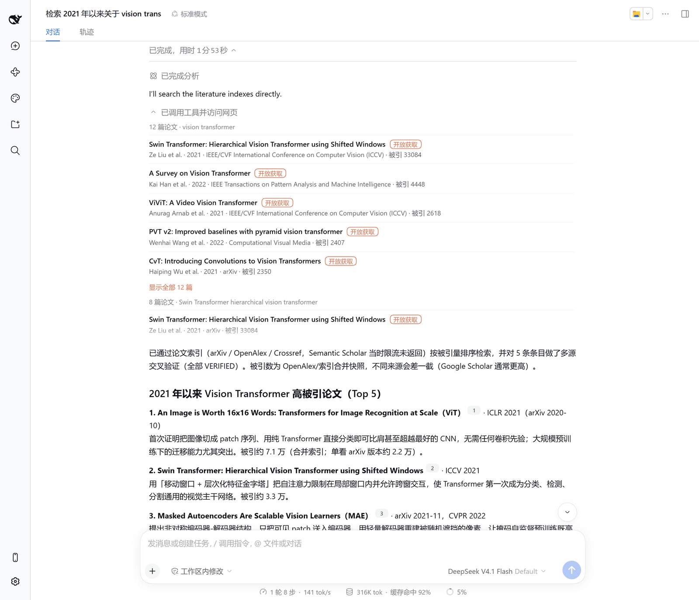
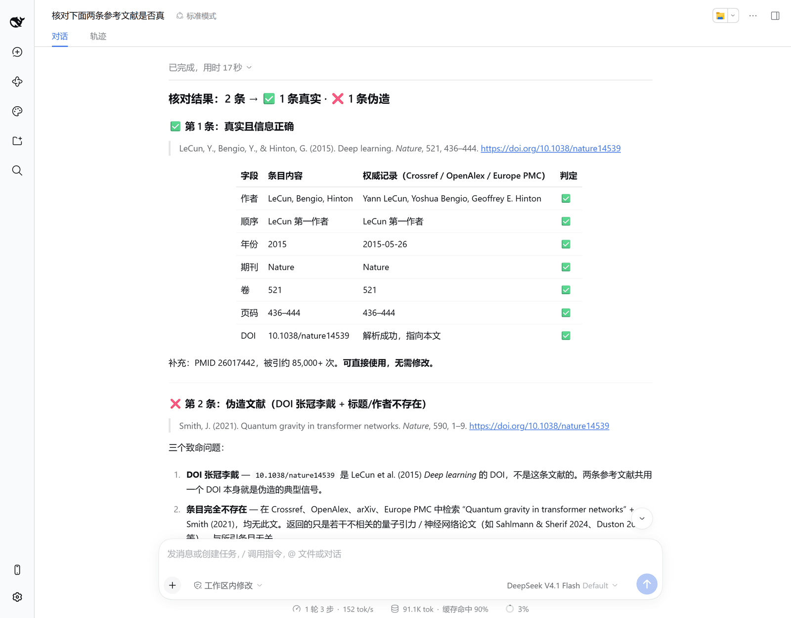
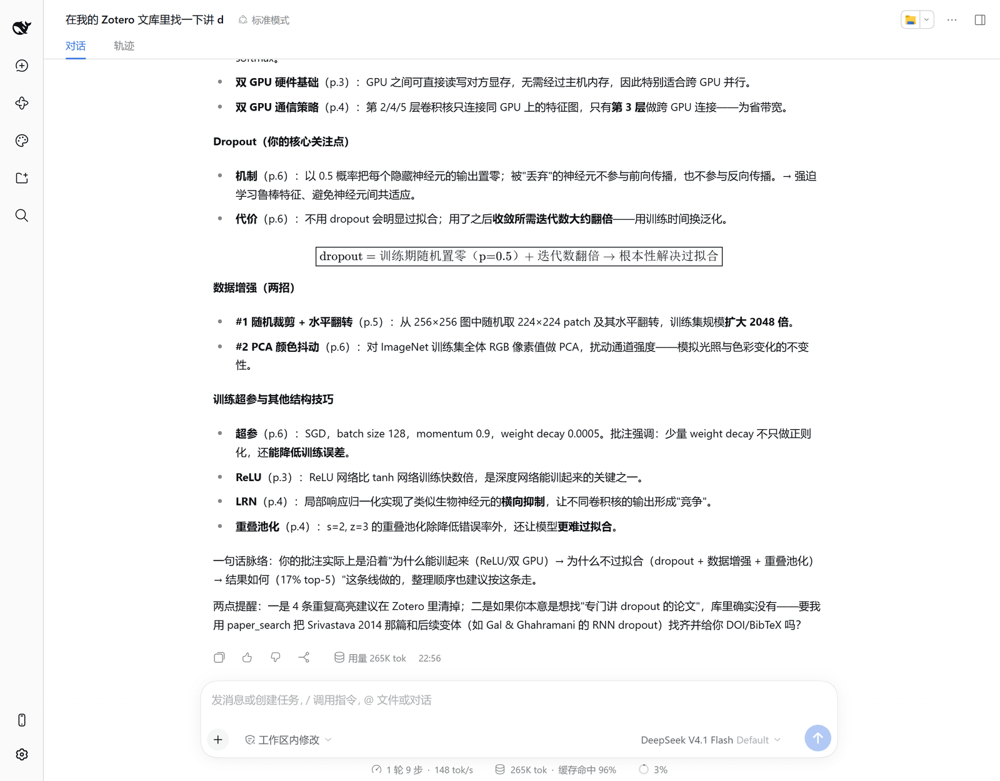
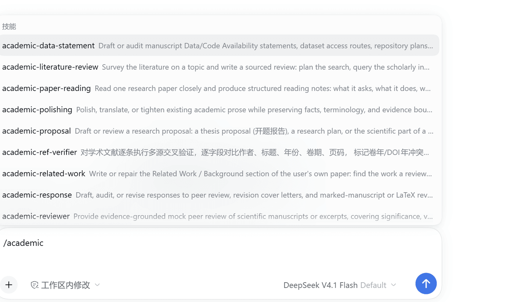
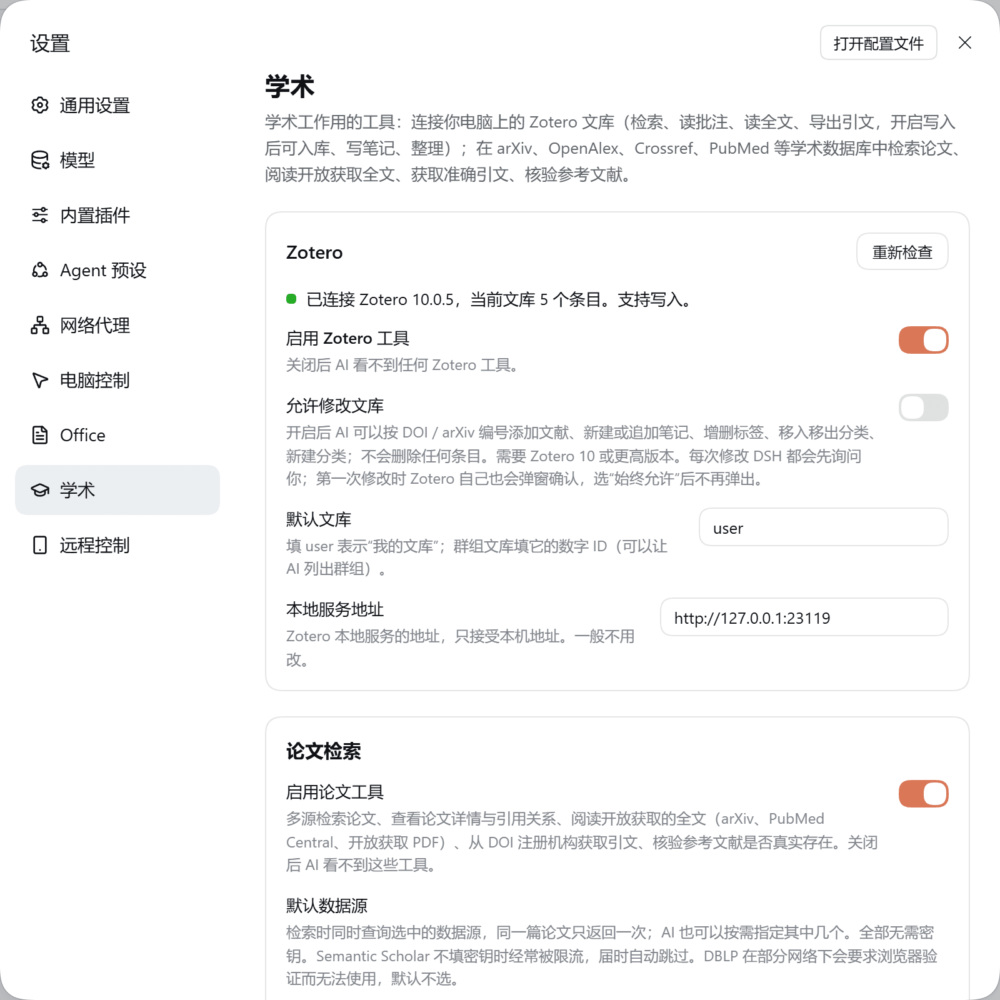

# dsh-academic

[](https://www.npmjs.com/package/@copylee/dsh-academic)

DeepSeek Harness 的学术插件，三部分：

- **Zotero**：AI 检索你电脑上的 Zotero 文库，读取条目和你在 PDF 里做的批注，阅读全文，导出引文；开启写入后可按 DOI / arXiv 编号入库、写笔记、整理标签和分类。
- **论文检索**：同时查询 arXiv、OpenAlex、Crossref、Semantic Scholar、PubMed、Europe PMC、DBLP，阅读开放获取的全文，从 DOI 注册机构取引文，核验参考文献是否真实存在。
- **学术技能**：内置 11 个技能，覆盖文献综述、论文精读、写作、润色、模拟审稿、回复审稿意见等。

全部用 TypeScript 实现，不需要 Python，也不需要另装 MCP 服务。所有检索源都可以不填密钥使用。



截图中回答里的引用角标由 [dsh-better-display](https://github.com/copylee711/dsh-better-display) 渲染；不装它时引用显示为普通链接。

| 核验参考文献 | 整理 Zotero 里的 PDF 批注 |
|---|---|
|  |  |

| 输入框里用斜杠调用技能 | 设置页 |
|---|---|
|  |  |

## 功能

### Zotero

| 功能 | 说明 |
|---|---|
| 文库检索 | 按标题、作者、年份检索，或在所有字段、笔记和 PDF 全文里检索；可限定分类、标签、条目类型、已存搜索 |
| 条目详情 | 全部元数据、摘要、标签、所在分类，以及子笔记、附件和 PDF 里的高亮与批注（带页码） |
| 阅读全文 | 分段读取正文，带页码标记；或给出问题，返回最相关的若干段落 |
| 导出引文 | BibTeX、BibLaTeX、RIS、CSL JSON，或按引文样式（APA、IEEE、Nature、GB/T 7714 等）生成参考文献和文内引用，均由 Zotero 本身生成 |
| 入库 | 按 DOI 或 arXiv 编号添加文献，元数据取自 DOI 注册机构和 arXiv；已有的不重复添加；arXiv 论文附带 PDF 链接 |
| 笔记 | 在条目下新建笔记、新建独立笔记，或向已有笔记追加内容（用 Markdown 书写） |
| 整理 | 增删标签、移入移出分类、新建分类 |

入库、笔记、整理三项默认关闭，需要 Zotero 10 或更高版本。插件不提供删除条目的功能。

### 论文检索

| 功能 | 说明 |
|---|---|
| 多源检索 | 一次查询多个数据源，同一篇论文（预印本与正式发表版、不同数据源的记录）合并为一条；可按年份、开放获取、arXiv 分类筛选，按相关度、时间或被引数排序 |
| 论文详情 | 按 DOI、arXiv 编号、PMID、PMCID 或标题查一篇论文：完整摘要、作者、期刊、被引数、开放获取链接、是否已撤稿 |
| 引用关系 | 谁引用了它、它引用了谁、相关论文 |
| 阅读全文 | arXiv 论文读 HTML 版（保留章节结构，公式为 LaTeX），PubMed Central 文章读结构化全文，其余读开放获取 PDF；可先看目录再读某一节，或按问题找段落 |
| 获取引文 | 从 DOI 注册机构取 BibTeX、RIS、CSL JSON 或指定样式的参考文献，不由模型凭记忆书写 |
| 核验参考文献 | 逐条检查 DOI 是否存在、是否指向另一篇文章，标题、第一作者、年份是否相符，是否已撤稿 |
| 下载 PDF | 把开放获取的 PDF 保存到工作区的 `papers/` 目录 |

只获取合法开放的全文，不绕过付费墙；读不到时如实告知。

### 学术技能

| 技能 | 用途 |
|---|---|
| `academic-literature-review` | 文献综述：制定检索策略、多轮检索与引文追溯、筛选、精读、按主题综合、核验引用 |
| `academic-paper-reading` | 论文精读：三遍阅读，输出结构化笔记，区分作者的结论与证据，可存入 Zotero |
| `academic-related-work` | 为自己的论文写“相关工作”：找审稿人期待看到的文献，说明与本文的区别 |
| `academic-proposal` | 开题报告、研究计划、基金申请书的科学部分 |
| `academic-writing` | 论文写作：章节起草、论证重构、首次投稿材料 |
| `academic-polishing` | 论文润色、学术翻译、正文精简、LaTeX 排版问题 |
| `academic-reviewer` | 模拟审稿：投稿前从审稿人角度评估 |
| `academic-response` | 回复审稿意见：逐点回复、返修信、修订稿 |
| `academic-statistics` | 统计报告审查：实验单元、重复、不确定度、检验方法、图注统计 |
| `academic-data-statement` | 数据与代码可用性声明、数据仓库选择、FAIR 元数据 |
| `academic-ref-verifier` | 参考文献逐字段核验 |

后七个改编自 [nature-skills](https://github.com/Yuan1z0825/nature-skills)（Apache-2.0），只改了技能名称（`nature-*` 改为 `academic-*`，避免与你自己安装的 nature-skills 冲突），详见 [skills/THIRD_PARTY_NOTICES.md](skills/THIRD_PARTY_NOTICES.md)。前四个为本插件编写。技能加载时，插件会附上一段说明，告诉 AI 用本插件的检索和 Zotero 工具来完成技能里提到的文献查询步骤。

## 安装

DSH 桌面版：**插件 → 添加插件**，输入 `@copylee/dsh-academic`，安装后启用。

命令行（web 等其他 profile）：

```bash
dsh plugin --profile web add @copylee/dsh-academic@latest
```

要求：DSH 0.2.0-rc.2 或更高。使用 Zotero 功能需要 Zotero 7 或更高（写入需要 Zotero 10），并在 Zotero 的 **设置 → 高级** 中勾选“允许此计算机上的其他应用程序与 Zotero 通讯”，且 Zotero 处于运行状态。论文检索需要能访问相应的学术网站；如需代理，使用 DSH 的全局代理设置。

## 使用

直接说要做什么，例如：

- 在我的 Zotero 里找关于 dropout 的论文，告诉我各自怎么用的
- 把我在这篇论文里的高亮整理成一份阅读笔记，存回 Zotero
- 检索近两年关于扩散模型加速采样的论文，按被引数排序
- 读一下 arXiv 2010.11929 的方法部分，它的位置编码是怎么做的？
- 给这三个 DOI 生成 GB/T 7714 格式的参考文献
- 帮我核对这份参考文献列表有没有错的或者不存在的
- 写一份关于图神经网络在分子性质预测中应用的文献综述
- 把 10.1038/nature14539 和 arXiv 2010.11929 加到“待读”分类

技能也可以在输入框里用斜杠点名，例如 `/academic-literature-review`。

## Agent 工具

| 工具 | 作用 |
|---|---|
| `zotero_search` | 检索文库；`mode=everything` 时同时在笔记和 PDF 全文里找，命中子条目时返回它所属的文献 |
| `zotero_browse` | 列出分类（树形路径）、标签、已存搜索、文库（个人文库与群组） |
| `zotero_get` | 一个条目的全部元数据，以及它的笔记、附件、PDF 批注 |
| `zotero_read` | 读文库中论文的正文：分段读取，或按问题返回最相关的段落 |
| `zotero_export` | 导出 BibTeX / BibLaTeX / RIS / CSL JSON，或格式化的参考文献与文内引用 |
| `zotero_attachment` | 附件在本机的文件路径，或网页链接附件的 URL |
| `zotero_add` | 按 DOI / arXiv 编号入库（需开启写入） |
| `zotero_note` | 新建或追加笔记（需开启写入） |
| `zotero_organize` | 增删标签、调整分类、新建分类（需开启写入） |
| `paper_search` | 多源检索论文 |
| `paper_get` | 查一篇论文的完整信息 |
| `paper_citations` | 被引、参考文献、相关论文 |
| `paper_read` | 读开放获取全文：目录、某一节、按问题找段落、分段读取 |
| `paper_cite` | 从 DOI 注册机构取引文 |
| `reference_verify` | 核验参考文献 |
| `paper_download` | 保存开放获取 PDF 到工作区 |

Zotero 条目用 `zotero://user/0/item/<KEY>`（群组为 `zotero://group/<id>/item/<KEY>`）标识；论文用 DOI、`arXiv:<编号>`、`PMID:<编号>` 标识。

## 设置

**设置 → 学术**，每项改动立即保存并生效。

| 设置 | 默认 | 说明 |
|---|---|---|
| 启用 Zotero 工具 | 开 | 关闭后 AI 看不到任何 Zotero 工具 |
| 允许修改文库 | 关 | 开启后提供入库、笔记、整理三个工具 |
| 默认文库 | `user` | `user` 为“我的文库”，群组文库填数字 ID |
| 本地服务地址 | `http://127.0.0.1:23119` | 只接受本机地址 |
| 启用论文工具 | 开 | 关闭后 AI 看不到 `paper_` 和 `reference_verify` 工具 |
| 默认数据源 | 除 DBLP 外全部 | 检索时默认查询的数据源 |
| 联系邮箱 | 空 | 发给 Crossref、OpenAlex、NCBI、Europe PMC、Unpaywall；填写后查找开放获取全文时才询问 Unpaywall |
| Semantic Scholar / OpenAlex / NCBI API Key | 空 | 都是可选的，只影响限速 |
| 默认引文样式 | `apa` | CSL 样式 ID |
| 单次读取全文的长度 | 12000 字符 | 分段阅读时每段的上限 |
| 单次检索条目数上限 | 20 | 一次检索最多返回的条目数 |
| 启用内置技能 | 开 | 可逐个开关 |

设置页顶部显示 Zotero 的连接状态、版本、是否支持写入。

## 修改 Zotero 文库时的确认

每次修改有两道确认：

1. DSH 的审批提示，说明要做什么（会话的审批策略设为不询问时跳过）。
2. Zotero 自己的授权弹窗。选“允许”只对这一次修改有效，下次还会弹出；选“始终允许”后不再弹出，可以在 Zotero 的设置里撤销。

修改条目时带上读取时的版本号，文库在此期间被改动过则放弃本次修改。

## 限制

- 读全文只限开放获取的论文。付费论文读不到；如果你的 Zotero 里有它的 PDF，用 Zotero 工具阅读。
- 扫描版 PDF（没有文字层）读不出文字。从 PDF 读出的文本没有章节结构，公式和表格可能错乱；arXiv 的 HTML 版和 PubMed Central 的全文没有这个问题。
- Semantic Scholar 不填密钥时经常被限流，此时自动跳过，结果里会注明。
- DBLP 在部分网络环境下要求浏览器验证，无法通过接口访问，因此默认不启用。
- 没有接入知网、万方、百度学术（它们不提供公开接口）。中文期刊只能查到 OpenAlex 和 Crossref 收录的部分。
- 参考文献核验依赖 Crossref、OpenAlex 和 arXiv 的收录；查不到不等于文献不存在（书籍、中文文献、会议论文集常常查不到），结果里会区分“未找到”和“有出入”。
- Zotero 7 到 9 的本地 API 只读，入库、笔记、整理不可用。附件文件尚未下载到本机时无法阅读。
- Zotero 入库只接受 DOI 和 arXiv 编号，不支持直接导入 BibTeX、ISBN 或网页，也不会下载 PDF 文件到 Zotero。
- 改编自 nature-skills 的技能中提到的画图、PPT、下载器等配套技能没有内置；其中两个可选的 Python 检查脚本随包附带，但只有本机装了 Python 才能运行。

## 数据与隐私

- 读取 Zotero 时，数据只在本机的 Zotero（`127.0.0.1`）和 DSH 之间传递，随后作为工具结果发给你在 DSH 里配置的模型。
- 论文检索把检索词、DOI 等标识符发给被查询的数据源：`export.arxiv.org`、`arxiv.org`、`ar5iv.labs.arxiv.org`、`api.openalex.org`、`api.crossref.org`、`api.semanticscholar.org`、`eutils.ncbi.nlm.nih.gov`、`www.ebi.ac.uk`（Europe PMC）、`dblp.org`、`doi.org`、`api.unpaywall.org`（仅在填写邮箱后），以及这些数据源给出的开放获取 PDF 所在的网站。
- 联系邮箱只发给 Crossref、OpenAlex、NCBI、Europe PMC 和 Unpaywall。API Key 只发给各自的服务。
- 读过的论文全文缓存在 `~/.dsh/storages/copylee-academic/papers/`。
- 选“始终允许”后，Zotero 发放的本地写入密钥保存在 `~/.dsh/storages/copylee-academic/zotero-key.json`，只对签发它的那个 Zotero 实例有效。

## 工作原理

Zotero 部分通过它的本地 API（`http://127.0.0.1:23119/api/`，与 Zotero Web API v3 同构）读写文库；引文导出和格式化由 Zotero 完成。全文来自 Zotero 的全文索引或本机 PDF。

论文检索直接调用各数据源的公开接口，结果统一为同一种记录，按 DOI、arXiv 编号、PMID 和标题合并，再用倒数排名融合排序。每个数据源按其要求限速（arXiv 每 3 秒一次），遇到 429 / 503 按 `Retry-After` 重试。全文按 arXiv HTML → ar5iv → PubMed Central → 开放获取 PDF 的顺序获取，PDF 用 pdf.js 提取文字。按问题找段落时用 BM25 排序，分词使用 `Intl.Segmenter`，中文也按词切分。

技能通过 DSH 的技能注册接口提供，优先级低于你自己安装的同名技能。

来自文库和网络的文本在交给模型时都标记为不可信内容。

## 开发

```bash
pnpm install
pnpm run typecheck
pnpm test
pnpm run build
node scripts/zotero-smoke.mjs "attention"   # 只读，需要本机 Zotero 在运行
node scripts/search-smoke.mjs "graph neural networks"   # 访问真实的学术接口
node scripts/import-nature-skills.mjs <nature-skills 的本地克隆>   # 重新生成改编的技能
```

`src/` 是源码，`lib/` 由构建生成，`skills/` 随包发布。测试用内存里的假 Zotero 服务和假网络，不访问外网。

## 许可证

MIT。`skills/` 中改编自 nature-skills 的部分为 Apache-2.0，见 [skills/THIRD_PARTY_NOTICES.md](skills/THIRD_PARTY_NOTICES.md)。
